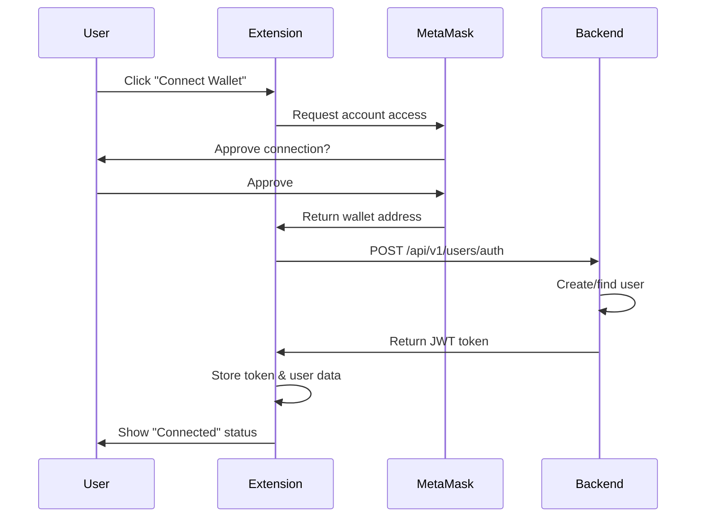
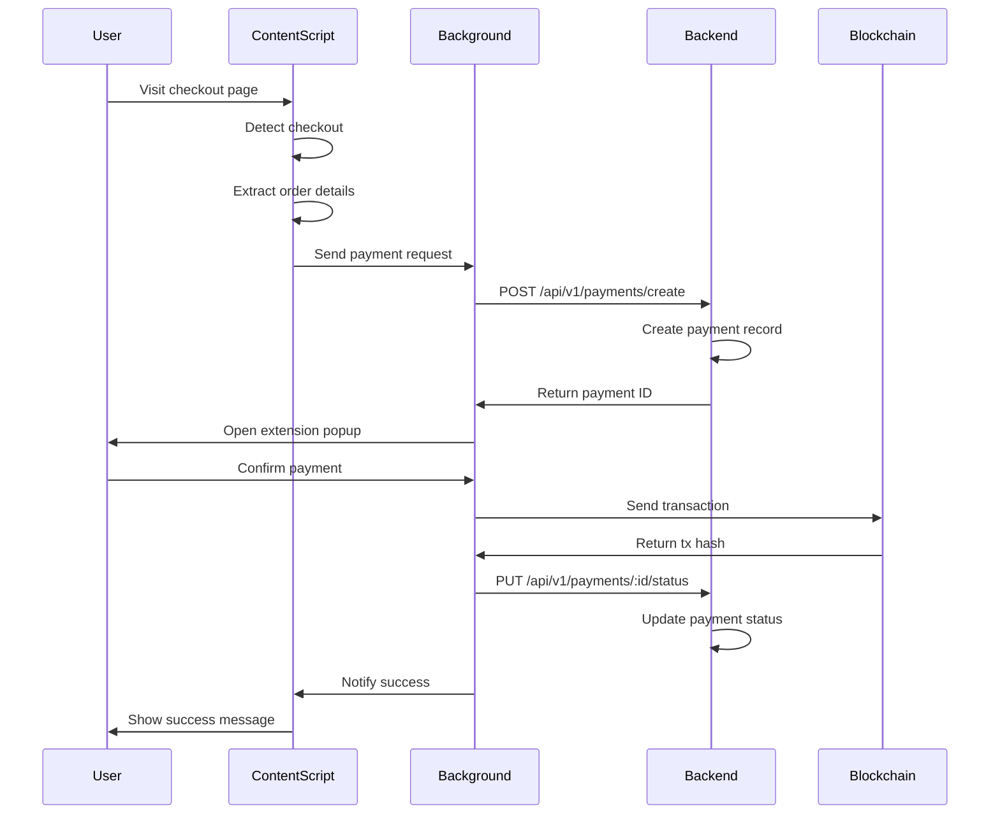

# 🔌 Backend Connection Guide

This guide explains how the ZetaPay browser extension connects to the backend API.

## Architecture Overview

```
┌─────────────────┐     ┌──────────────────┐     ┌─────────────────┐
│  Content Script │────>│ Background Worker │────>│  Backend API    │
│  (content.js)   │     │  (background.js)  │     │ (localhost:3000)│
└─────────────────┘     └──────────────────┘     └─────────────────┘
        │                        │                         │
        │                        │                         │
    Detects                 Manages              Processes
    Checkout              Authentication          Payments
    Pages                 & API Calls            & Stores Data
```

## Components

### 1. **API Client** (`api-client.js`)
Handles all HTTP communication with the backend.

**Key Methods:**
- `authenticate(walletAddress)` - Authenticate user with wallet
- `createPayment(paymentData)` - Create new payment
- `getPaymentHistory()` - Fetch user's transaction history
- `updatePaymentStatus(paymentId, status, txHash)` - Update payment status
- `getUserProfile()` - Get user profile
- `updateSettings(settings)` - Update user preferences

**Usage:**
```javascript
// Initialize
await api.init();

// Authenticate
const auth = await api.authenticate('0x123...');

// Create payment
const payment = await api.createPayment({
  amount: '100.00',
  currency: 'USD',
  merchant: 'Amazon',
});
```

### 2. **Wallet Manager** (`wallet-manager.js`)
Manages Web3 wallet connections (MetaMask).

**Key Methods:**
- `connect()` - Connect to MetaMask
- `disconnect()` - Disconnect wallet
- `sendTransaction(to, value, data)` - Send blockchain transaction
- `signMessage(message)` - Sign message with private key
- `getBalance()` - Get wallet balance
- `switchChain(chainId)` - Switch to different network

**Usage:**
```javascript
// Connect wallet
const result = await walletManager.connect();
console.log('Connected:', result.account);

// Send transaction
const txHash = await walletManager.sendTransaction(
  '0xRecipientAddress',
  '1000000000000000000', // 1 ETH in wei
  '0x'
);
```

### 3. **Background Worker** (`background.js`)
Service worker that manages:
- API client initialization
- Message passing between content script and popup
- Authentication state
- Transaction storage
- Browser notifications
- Price alerts

### 4. **Content Script** (`content.js`)
Runs on web pages to:
- Detect checkout pages
- Extract order details
- Inject payment button
- Send payment requests to background worker

## Authentication Flow



### Step-by-Step:

1. **User clicks "Connect Wallet"** in extension popup
2. **Extension calls** `walletManager.connect()`
3. **MetaMask prompts** user to approve connection
4. **User approves**, MetaMask returns wallet address
5. **Extension calls** `api.authenticate(walletAddress)`
6. **Backend creates/finds** user in database
7. **Backend returns** JWT token + user data
8. **Extension stores** token in `chrome.storage.local`
9. **Extension uses** token for all subsequent API calls

## Payment Flow



### Step-by-Step:

1. **Content script detects** checkout page (Amazon, Shopify, etc.)
2. **Extracts order details** (amount, currency, merchant)
3. **Sends message** to background worker
4. **Background calls** `api.createPayment(orderDetails)`
5. **Backend creates** payment record with status "pending"
6. **Backend returns** payment ID and reference
7. **Extension opens** popup with payment details
8. **User reviews** and confirms payment
9. **Wallet manager sends** transaction to blockchain
10. **Transaction confirms**, background calls `api.updatePaymentStatus()`
11. **Backend updates** payment status to "completed"
12. **Content script shows** success notification on page

## API Endpoints Used

### User Endpoints
- `POST /api/v1/users/auth` - Authenticate with wallet address
- `GET /api/v1/users/me` - Get current user profile
- `PUT /api/v1/users/settings` - Update user settings
- `GET /api/v1/users/payments` - Get payment history
- `GET /api/v1/users/payments/:id` - Get specific payment

### Payment Endpoints
- `POST /api/v1/payments/create` - Create new payment
- `PUT /api/v1/payments/:id/status` - Update payment status
- `GET /api/v1/payments/:id` - Get payment details
- `POST /api/v1/payments/convert` - Convert currency

## Data Storage

### Chrome Local Storage
```javascript
{
  authToken: "eyJhbGciOiJIUzI1NiIsInR5cCI6IkpXVCJ9...",
  user: {
    id: "uuid",
    walletAddress: "0x123...",
    email: "user@example.com",
    settings: {...}
  },
  transactions: [...],  // Local transaction cache
  priceAlerts: [...],   // User's price alerts
  settings: {...}       // Extension settings
}
```

### Backend Database (PostgreSQL)
- **users** table - User profiles and settings
- **payments** table - Payment records
- **merchants** table - Merchant information
- **subscriptions** table - Recurring payments
- **invoices** table - Invoice records

## Configuration

### Environment Variables (.env)
```bash
# Backend API
REACT_APP_API_URL=http://localhost:3000/api/v1

# Network Settings
REACT_APP_DEFAULT_NETWORK=zetachain-testnet
REACT_APP_CHAIN_ID=0x1b59

# Contract Addresses
REACT_APP_PAYMENT_CONTRACT=0x...
```

### Extension Manifest Permissions
```json
{
  "permissions": [
    "storage",      // Store auth token & user data
    "activeTab",    // Access current tab
    "notifications" // Show browser notifications
  ],
  "host_permissions": [
    "http://localhost:3000/*",  // Development API
    "https://api.zetapay.app/*" // Production API
  ]
}
```

## Testing

### 1. **Start Backend**
```bash
cd backend
npm run dev
# Backend runs on http://localhost:3000
```

### 2. **Load Extension**
```bash
cd web
npm run build:extension
# Load unpacked from web/extension-build
```

### 3. **Test Authentication**
- Open extension popup
- Click "Connect Wallet"
- Approve MetaMask connection
- Verify user appears in backend database

### 4. **Test Payment Flow**
- Navigate to Amazon/Shopify checkout
- Verify "Pay with Crypto" button appears
- Click button
- Verify payment created in backend (check logs)
- Confirm payment in extension popup

### 5. **Check API Logs**
```bash
# Backend logs show:
✅ New user created: 0x123...
✅ Payment created: PAY-2025-000001
✅ Payment updated to completed
```

## Troubleshooting

### Extension Can't Connect to Backend
**Issue:** `Failed to fetch` or `Network request failed`

**Solutions:**
1. Verify backend is running: `curl http://localhost:3000/health`
2. Check CORS settings in backend
3. Add localhost to `host_permissions` in manifest.json
4. Check browser console for errors

### Authentication Fails
**Issue:** `Invalid token` or `User not found`

**Solutions:**
1. Clear extension storage: `chrome.storage.local.clear()`
2. Verify JWT_SECRET in backend .env
3. Check token expiration (default 30 days)
4. Reconnect wallet

### Payments Not Saved
**Issue:** Payments don't appear in history

**Solutions:**
1. Check backend database connection
2. Verify payment creation in logs
3. Ensure user is authenticated
4. Check API token is included in requests

## Security Considerations

1. **Never store private keys** - Only wallet addresses
2. **JWT tokens expire** after 30 days
3. **API requests use HTTPS** in production
4. **Signature verification** for sensitive operations
5. **Rate limiting** on backend endpoints
6. **Input validation** on all API endpoints

## Next Steps

1. ✅ Backend API endpoints created
2. ✅ API client implemented
3. ✅ Wallet manager implemented
4. ⏳ Update extension popup UI
5. ⏳ Integrate transaction signing
6. ⏳ Add error handling & retry logic
7. ⏳ Deploy backend to production
8. ⏳ Update extension with production API URL

---

**For more information:**
- Backend API docs: `backend/README.md`
- Extension docs: `web/EXTENSION_FEATURES.md`
- Smart contract docs: `contracts/README.md`
